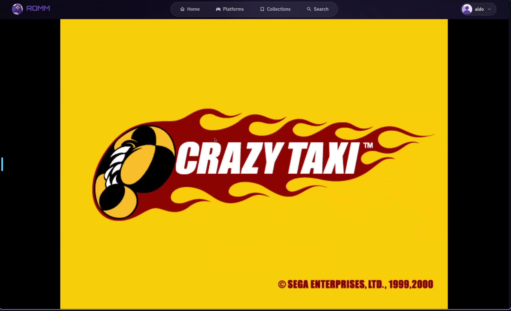

# Gallery

Screenshots of flycast-romm in action — Dreamcast games streaming to the browser
via [Selkies](https://github.com/selkies-project/selkies) WebRTC.

To add your own captures, drop images into `docs/assets/gallery/` and update this file.

---

## Crazy Taxi — in-browser stream

<!--
  Placeholder: docs/assets/gallery/01-crazy-taxi-stream.png
  Suggested capture: full-browser view of Crazy Taxi running inside the RomM iframe.
  Aim for 1920×1080 or 1280×960 (the default SELKIES_MANUAL_* resolution).
-->

  

> Crazy Taxi (Dreamcast) running at 1280×960 inside RomM's streaming iframe,
> delivered by Selkies WebRTC from a local homelab GPU.

---

## RomM game launcher — Dreamcast library

<!--
  Placeholder: docs/assets/gallery/02-romm-dc-library.png
  Suggested capture: RomM web UI showing the Dreamcast platform page with
  the "Play" / streaming button visible.
-->

  

> RomM's Dreamcast library. Clicking **Play** hits the broker, which boots Flycast
> and returns the Selkies stream URL to the frontend.

---

## Save-state slot selector

<!--
  Placeholder: docs/assets/gallery/03-save-state-slots.png
  Suggested capture: RomM's slot selector overlay (slots 1-9 + autosave 10)
  visible during a running Dreamcast session. Requires the four-line upstream
  patch to RomM — see "Contributing upstream" in the README.
-->

  

> Save-state slot selector (slots 1–9 manual, slot 10 autosave) once the
> `_PLATFORM_CAPABILITIES` patch lands in RomM upstream.

---

*Images not yet present here are placeholders — drop the files in
`docs/assets/gallery/` with the names above and the images will render.*
